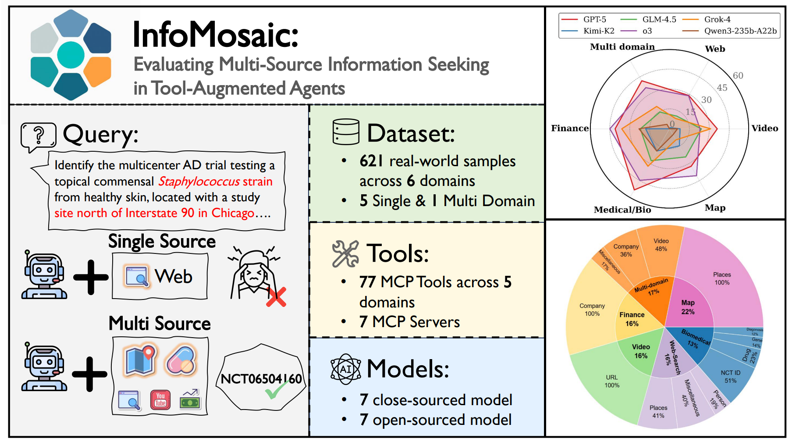
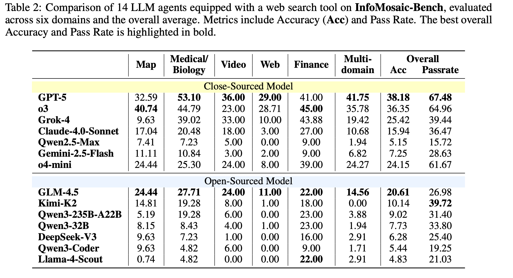
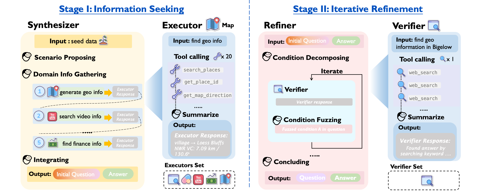

<div align="center">
  
  
  <div style="background-color: #f0f8ff; padding: 15px; border-radius: 10px; margin: 20px 0; border: 2px solid #87cefa;">
    <h3>🚀 One-Stop Automated Agent Evaluation & Tool Deployment Framework</h3>
    <p><strong>Complete all environment configurations and tool deployments with a single command, supporting multimodal, multi-source information retrieval and evaluation</strong></p>
  </div>
</div>


<div align="center">
  <a href="https://arxiv.org/pdf/2510.02271" target="_blank"></a>
  <a href="https://huggingface.co/datasets/Dorothydu/InfoMosaic_Bench" target="_blank"></a>
  <a href="README_CN.md" target="_blank"></a>
</div>


<div align="center">
  
  <p><em>InfoMosaic-Bench Overview</em></p>
</div>

## 📚 Project Overview

InfoMosaic is a comprehensive framework designed for advanced information retrieval, multi-step reasoning, and performance evaluation of large language models (LLMs). This project is based on the research paper ["InfoMosaic: A Multimodal, Multi-Source Benchmark for Information Integration and Reasoning"](https://arxiv.org/pdf/2510.02271) and leverages the [InfoMosaic_Bench dataset](https://huggingface.co/datasets/Dorothydu/InfoMosaic_Bench) for evaluation.

The framework enables:
- Multi-source information retrieval and integration
- Rigorous evaluation of LLM's reasoning capabilities
- Flexible tool usage for enhanced information acquisition
- Parallel processing for efficient benchmarking

## 📊 Evaluation Results

Comparison of 14 LLM agents equipped with a web search tool on **InfoMosaic-Bench**, evaluated across six domains and the overall average. Metrics include Accuracy (**Acc**) and Pass Rate. The best overall Accuracy and Pass Rate is highlighted in bold.

<div align="center">
  
  <p><em>InfoMosaic-Bench Evaluation Results</em></p>
</div>

## 📁 Project Structure

```
InfoMosaic/
├── data/                   # Data preparation and management
├── eval/                   # Evaluation utilities
├── inference/              # Inference components
├── tool_backends/          # Backend services for tools
│   ├── MCP/                     # Multi-Content Protocol tools
│   ├── api_proxy/               # API proxies
│   ├── configs/                 # Configuration files
│   └── test/                    # Test scripts for tools
├── infer_answer.py         # Main inference script
├── ensemble_answer.py      # Script to avoid answer leakage
├── gen_result.py           # Result generation
├── utils.py                # Utility functions
└── README.md               # Project documentation
```

## 🔧 Installation & Setup

### Prerequisites
- Python 3.8+ or Docker
- API keys for external services (serper, google_map, youtube, serapi)

### Installation
```bash
# Clone the repository
git clone git@github.com:DorothyDUUU/Info-Mosaic.git # If applicable
cd InfoMosaic

# Install dependencies
pip install . 
```

### 🔑 API Key Configuration

For detailed instructions on API key configuration, please refer to the following README [API Key and Configuration Management Guide](tool_backends/MCP/README_API_KEYS_EN.md)

This document provides comprehensive information about configuring API keys for all external services used in InfoMosaic, including web search, maps, and other tools.

### Starting Tool Backends

This is by far the simplest automated tool deployment repository! InfoMosaic Tool Backend Services launches MCP server based on Python sandbox, providing an extremely simple one-click deployment solution.

To enable the full functionality of the tools, please refer to the detailed deployment guide:

- [Tool Backend Deployment Guide](tool_backends/README.md)

This document provides complete deployment steps, including Docker deployment, quick deployment scripts, service management, and testing tools. All services can be configured and started with just one command.

## 🚀 Inference & Evaluation

### Data Preparation

First, prepare the dataset by combining the HuggingFace benchmark data with ground truth answers:

```bash
python data/prepare_data.py
```

This script will:
1. Download the [InfoMosaic_Bench dataset](https://huggingface.co/datasets/Dorothydu/InfoMosaic_Bench) from HuggingFace
2. Load the ground truth answers from `data/info_mosaic_gt_answer.jsonl`
3. Combine the datasets and save to `data/info_mosaic_w_gt.jsonl`


### Running Inference

Run the inference script to evaluate a model on the benchmark:

```bash
export OPENAI_API_BASE_URL="https://api.openai.com/v1"
export OPENAI_API_KEY="sk-..."
export SERPER_API_KEY="your_serper_api_key"
sh inference/run_infer.sh
```

**Key arguments:**
- `--model_name`: Type of agent to use: agent_wo_tool (no tools), agent_w_web_tool (web tool only), or agent_w_multi_tool (multiple tools)
- `--parallel_size`: Number of parallel threads for processing
- `--llm_name`: Name of the LLM model to use, default is "gpt-5-mini"
- `--domain`: Domain to evaluate, default is "all", optional values are 'all', 'map', 'bio', 'financial', 'web', 'video', 'multidomain'


### 📊 Evaluation

Evaluate the model's performance using the pass rate evaluation script:

```bash
export OPENAI_API_BASE_URL="https://api.openai.com/v1"
export OPENAI_API_KEY="sk-..."
sh eval/run_eval.sh
```

**Key arguments:**
- `--model_name`: Type of agent to use: agent_wo_tool (no tools), agent_w_web_tool (web tool only), or agent_w_multi_tool (multiple tools)
- `--domain`: Domain to evaluate, default is "all", optional values are 'all', 'map', 'bio', 'financial', 'web', 'video', 'multidomain'

This script will:
1. Load the model's generated answers
2. Use a judge LLM to evaluate the correctness of answers
3. Calculate pass rates for sub-questions and final answers
4. Generate detailed evaluation metrics

## 🔄 Data Synthesis Pipeline: InfoMosaic Flow (comming soon)
Looking forward to the release of InfoMosaic Flow!




## 📚 Citation

If you use this framework or dataset in your research, please cite our paper:

```
@article{du2025infomosaic,
  title={InfoMosaic-Bench: Evaluating Multi-Source Information Seeking in Tool-Augmented Agents},
  author={Du, Yaxin and Zhang, Yuanshuo and Yang, Xiyuan and Zhou, Yifan and Wang, Cheng and Zou, Gongyi and Pang, Xianghe and Wang, Wenhao and Chen, Menglan and Tang, Shuo and others},
  journal={arXiv preprint arXiv:2510.02271},
  year={2025}
}
```

And the dataset:

```
@dataset{InfoMosaic_Bench,
  title = {InfoMosaic_Bench},
  author = {Dorothydu},
  year = {2025},
  publisher = {Hugging Face},
  url = {https://huggingface.co/datasets/Dorothydu/InfoMosaic_Bench}
}
```

## 🔗 Links
- [Research Paper](https://arxiv.org/pdf/2510.02271)
- [HuggingFace Dataset](https://huggingface.co/datasets/Dorothydu/InfoMosaic_Bench)

## 🤝 Contributing

Contributions to improve InfoMosaic are welcome! Please refer to the project's GitHub repository (if available) for contribution guidelines.

## 🙏 Acknowledgements

We would like to express our gratitude to the following open-source projects that have inspired and supported the development of InfoMosaic:

- [Browse-Master](https://github.com/sjtu-sai-agents/Browse-Master)
- [mcp_sandbox](https://github.com/sjtu-sai-agents/mcp_sandbox)
- [amap-mcp-server](https://github.com/sugarforever/amap-mcp-server)
- [biomcp](https://github.com/genomoncology/biomcp/tree/main)
- [fmp-mcp-server](https://github.com/cdtait/fmp-mcp-server)
- [googlemap-mcp](https://github.com/hidariutiwa/googlemap-mcp/tree/master)
- [serper-mcp-server](https://github.com/garylab/serper-mcp-server/)
- [mcp-youtube](https://github.com/sparfenyuk/mcp-youtube)


## 📝 License

This project is licensed under the Apache License 2.0 - see the [LICENSE](https://www.apache.org/licenses/LICENSE-2.0) file for details.