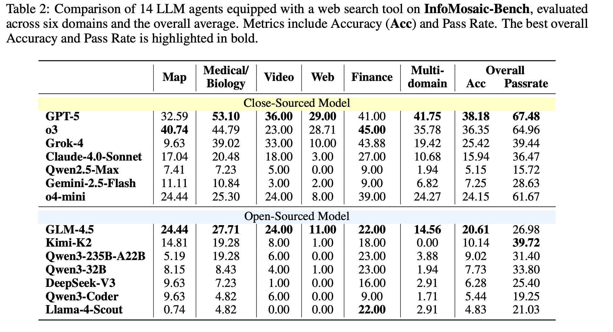

# InfoMosaic

<div align="center">
  
  
  <div style="background-color: #f0f8ff; padding: 15px; border-radius: 10px; margin: 20px 0; border: 2px solid #87cefa;">
    <h3>🚀 一站式自动化 Agent 评测与工具部署框架</h3>
    <p><strong>一个命令即可完成全部环境配置与工具部署，支持多模态、多源信息检索与评估</strong></p>
  </div>
  
  <p><em>高级信息检索与评估框架</em></p>
</div>

<div align="center">
  
  <p><em>InfoMosaic系统概览</em></p>
</div>

## 📚 项目概述

InfoMosaic是一个综合框架，专为大语言模型（LLMs）的高级信息检索、多步推理和性能评估而设计。该项目基于研究论文《InfoMosaic: A Multimodal, Multi-Source Benchmark for Information Integration and Reasoning》，并利用InfoMosaic_Bench数据集进行评估。

该框架支持：
- 多源信息检索与整合
- LLM推理能力的严格评估
- 灵活的工具使用以增强信息获取
- 并行处理以实现高效的基准测试

## 📊 评估结果

下图展示了14个配备网络搜索工具的LLM代理在InfoMosaic-Bench上的表现比较，评估涵盖六个领域和总体平均水平。指标包括准确率（Acc）和通过率。整体最佳准确率和通过率以粗体突出显示。

<div align="center">
  
  <p><em>InfoMosaic-Bench评估结果</em></p>
</div>

## 📁 项目结构

```
InfoMosaic/
├── data/                   # 数据准备和管理
├── eval/                   # 评估工具
├── inference/              # 推理组件
├── tool_backends/          # 工具后端服务
│   ├── MCP/                     # 多内容协议工具
│   ├── api_proxy/               # API代理
│   ├── configs/                 # 配置文件
│   └── test/                    # 工具测试脚本
├── infer_answer.py         # 主推理脚本
├── ensemble_answer.py      # 避免答案泄露的脚本
├── gen_result.py           # 结果生成
├── utils.py                # 实用函数
└── README.md               # 项目文档
```

## 🔧 安装与设置

### 先决条件
- Python 3.8+ 或 Docker
- 外部服务的API密钥（serper, google_map, youtube, serapi）

### 安装
```bash
# 克隆仓库
git clone git@github.com:DorothyDUUU/Info-Mosaic.git # 如果适用
cd InfoMosaic

# 安装依赖
pip install . 
```

### 🔑 API密钥配置

有关API密钥配置的详细说明，请参考以下文档 [API密钥与配置管理指南](tool_backends/MCP/README_API_KEYS_ZH.md)

该文档提供了有关配置InfoMosaic中使用的所有外部服务（包括网络搜索、地图和其他工具）API密钥的全面信息。

### 启动工具后端

这是迄今为止最简单的自动化工具部署仓库！InfoMosaic Tool Backend Services基于Python沙箱启动MCP服务器，提供极其简单的一键部署解决方案。

要启用工具的完整功能，请参考详细的部署指南：

- [工具后端部署指南](tool_backends/README_ZH.md)

该文档提供了完整的部署步骤，包括Docker部署、快速部署脚本、服务管理和测试工具等内容，只需一个命令即可完成所有服务的配置和启动。

## 🚀 推理与评估

### 数据准备

首先，通过将HuggingFace基准数据与标准答案结合来准备数据集：

```bash
python data/prepare_data.py
```

该脚本将：
1. 从HuggingFace下载[InfoMosaic_Bench数据集](https://huggingface.co/datasets/Dorothydu/InfoMosaic_Bench)
2. 从`data/info_mosaic_gt_answer.jsonl`加载标准答案
3. 合并数据集并保存到`data/info_mosaic_w_gt.jsonl`

### 运行推理

运行推理脚本以在基准上评估模型：

```bash
python infer_answer.py --model_name <model-name> --parallel_size <num-threads>
```

**关键参数：**
- `--model_name`：要评估的模型名称
- `--parallel_size`：用于处理的并行线程数
- `--api_base`：API的基础URL（如果使用自定义端点）
- `--api_key`：访问模型的API密钥
- `--temperature`：生成的温度设置

### 📊 评估

使用通过率评估脚本评估模型的性能：

```bash
python eval/pass_rate_eval.py
```

该脚本将：
1. 加载模型生成的答案
2. 使用判断LLM评估答案的正确性
3. 计算子问题和最终答案的通过率
4. 生成详细的评估指标

## 🔄 数据合成管道：InfoMosaic Flow（即将推出）


## 📚 引用

如果您在研究中使用了此框架或数据集，请引用我们的论文：

```
@article{du2025infomosaic,
  title={InfoMosaic-Bench: Evaluating Multi-Source Information Seeking in Tool-Augmented Agents},
  author={Du, Yaxin and Zhang, Yuanshuo and Yang, Xiyuan and Zhou, Yifan and Wang, Cheng and Zou, Gongyi and Pang, Xianghe and Wang, Wenhao and Chen, Menglan and Tang, Shuo and others},
  journal={arXiv preprint arXiv:2510.02271},
  year={2025}
}
```

以及数据集：

```
@dataset{InfoMosaic_Bench,
  title = {InfoMosaic_Bench},
  author = {Dorothydu},
  year = {2025},
  publisher = {Hugging Face},
  url = {https://huggingface.co/datasets/Dorothydu/InfoMosaic_Bench}
}
```

## 🔗 链接
- [研究论文](https://arxiv.org/pdf/2510.02271)
- [HuggingFace数据集](https://huggingface.co/datasets/Dorothydu/InfoMosaic_Bench)

## 🤝 贡献

欢迎为改进InfoMosaic做出贡献！请参考项目的GitHub仓库（如有）了解贡献指南。

## 🙏 致谢

我们要向以下启发和支持InfoMosaic开发的开源项目表示感谢：

- [Browse-Master](https://github.com/sjtu-sai-agents/Browse-Master)：Browse-Master的官方实现，一个工具增强的网络搜索代理。
- [mcp_sandbox](https://github.com/sjtu-sai-agents/mcp_sandbox)：Browse-Master的官方沙箱

## 📝 许可证

该项目采用Apache License 2.0许可证 - 有关详细信息，请参阅[LICENSE](https://www.apache.org/licenses/LICENSE-2.0)文件。